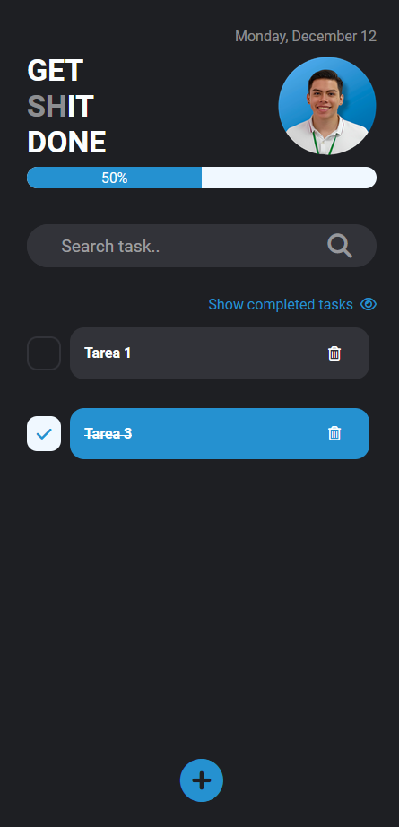

# My first proyect with React.

In the past, I had created a React project using an api, in that application you can search all the images you can imagine, but I didn't understand React concepts like useHooks, Statesfuls and Statesless, in this project I try to apply these concepts, in a simple application.

### Preview:

